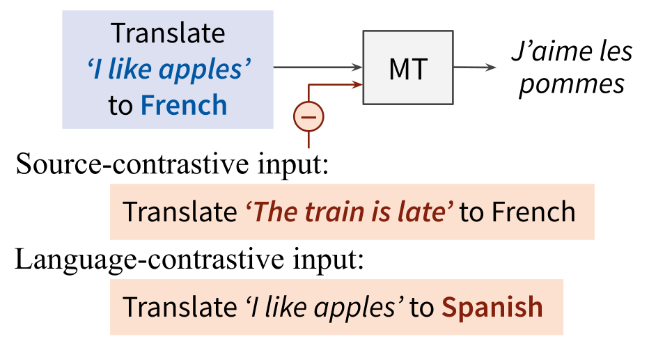

# Contrastive Decoding

[](#python)
[](https://arxiv.org/abs/2309.07098)
[](https://opensource.org/licenses/MIT) 

<p align="center">
  
</p>

This repository implements source-contrastive and language-contrastive decoding, as described in [Sennrich et al. (EACL 2024)](https://arxiv.org/abs/2309.07098).

- In **source-contrastive decoding**, we search for a translation that maximizes P(_Y_|_X_) - λ·P(_Y_|_X'_), where _X'_ is a random source segment. This penalizes hallucinations.

- In **language-contrastive decoding**, we search for a translation that maximizes P(_Y_|_X_,_l_y_) - λ·P(_Y_|_X_,_l_y'_), where _l_y_ is the language indicator for the desired target language, _l_y'_ the indicator for some undesired language (such as English or the source language). This penalizes off-target translations.

<p align="center">

</p>

## Installation

- `pip install -r requirements.txt`

## Usage

**Example commands**

Source-contrastive decoding with [M2M-100 (418M)](https://arxiv.org/abs/2010.11125) on Asturian–Croatian, with λ_src=0.7:
- `python -m scripts.run --model_path m2m100_418M --language_pairs ast-hr --source_contrastive --source_weight -0.7`

Source-contrastive and language-contrastive decoding with [SMaLL-100](https://arxiv.org/abs/2210.11621) on Pashto–Asturian, with 2 random source segments, λ_src=0.7, λ_lang=0.1, and English and Pashto as contrastive target languages:
- `python -m scripts.run --model_path small100 --language_pairs ps-ast --source_contrastive 2 --source_weight -0.7 --language_contrastive en ps  --language_weight -0.1`

Language-contrastive decoding with [Llama 2 Chat (7B)](https://arxiv.org/abs/2307.09288) on English–German, with λ_lang=0.5 and English as contrastive target language, using prompting with a one-shot example:
- `python -m scripts.run --model_path llama-2-7b-chat --language_pairs en-de --language_contrastive en  --language_weight -0.5 --oneshot`

## Dataset and Models:

This repository automatically downloads and uses [FLORES-101](https://huggingface.co/datasets/gsarti/flores_101) for evaluation. ```devtest``` section is used for the evaluation.

Multiple models are implemented:

- [M2M-100 (418M)](https://huggingface.co/facebook/m2m100_418M). Use `--model_path m2m100_418M`
- [SMaLL-100](https://huggingface.co/alirezamsh/small100). Use `--model_path small100`
- [Llama 2 7B Chat](https://huggingface.co/meta-llama). Use `--model_path llama-2-7b-chat` or `llama-2-13b-chat`


## Evaluation

ChrF2:
```
sacrebleu ref.txt < output.txt --metrics chrf
```


spBLEU:
```
sacrebleu ref.txt < output.txt --tokenize flores101
```


## Reference

```bibtex
@inproceedings{sennrich-etal-2024-mitigating,
      title={Mitigating Hallucinations and Off-target Machine Translation with Source-Contrastive and Language-Contrastive Decoding}, 
      author={Rico Sennrich and Jannis Vamvas and Alireza Mohammadshahi},
      booktitle={18th Conference of the European Chapter of the Association for Computational Linguistics},
      year={2024}
}
```
